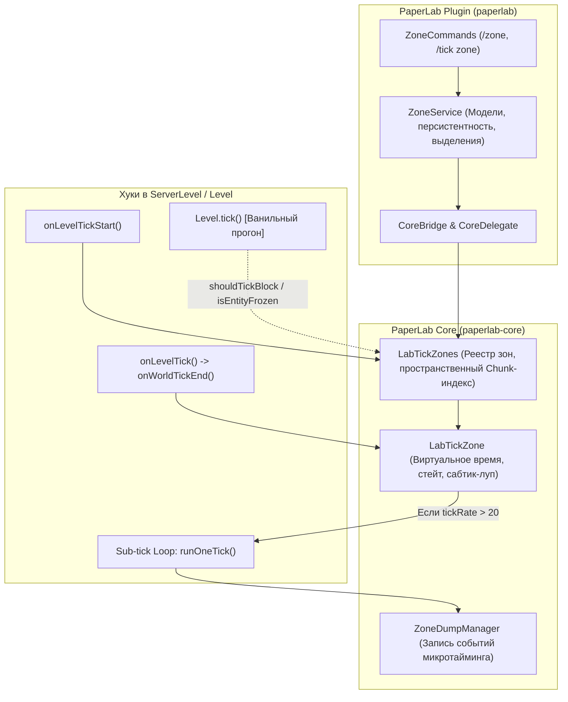

# Отчёт о текущем состоянии подсистемы Tick Zones в PaperLab

> **Дата составления:** 7 сентября 2026 г.  
> **Окружение:** Minecraft 26.2 / Paper fork (`paperlab-core`) + Плагин (`paperlab`)  
> **Статус сборки:** Релиз **не собирался** (по прямому указанию пользователя). Все изменения закоммичены и отправлены в удалённые репозитории GitHub.

---

## 1. Ссылки на актуальные репозитории и ветки

Оба репозитория полностью синхронизированы с GitHub (ветки `feature/carpet-tools`):

| Компонент | Репозиторий | Актуальная ветка | Хеш коммита | Ссылка на ветку GitHub |
| :--- | :--- | :--- | :--- | :--- |
| **Ядро** | `paperlab-core` | `feature/carpet-tools` | [`d2e837dc4`](https://github.com/florentem/paperlab-core/commit/d2e837dc4) | [florentem/paperlab-core (branch: feature/carpet-tools)](https://github.com/florentem/paperlab-core/tree/feature/carpet-tools) |
| **Плагин** | `paperlab` | `feature/carpet-tools` | [`4482e8b`](https://github.com/florentem/paperlab/commit/4482e8b) | [florentem/paperlab (branch: feature/carpet-tools)](https://github.com/florentem/paperlab/tree/feature/carpet-tools) |

### Дерево последних коммитов ядра (`paperlab-core`)
- `d2e837dc4` — `fix(zone): add sprintZone and stepZone delegates, reset spigot primed TNT counter in runOneTick`
- `48030846b` — `fix(zone): align zoneGameTime initialization and reset accumulator on rate transitions`
- `c7eb7246c` — `feat(dump): add high-resolution event dump system and carpet tnt/drop rules`
- `c292e86fe` — `fix(zone): unify tick suppression and vanilla pipeline execution for stepping and frozen zones`
- `fc2f715d8` — `fix(zone): complete vanilla parity for normal rate zones and clean up zone ticking`

### Дерево последних коммитов плагина (`paperlab`)
- `4482e8b` — `feat(zone): add direct console /zone rate, freeze, step, sprint commands and blockUpdates rule`
- `948c152` — `feat(dump): add /tick zone dump command and carpet rules`
- `d0596df` — `fix(hud, zone): separate tps/mspt hud display, clear highlight on unfocus`
- `1b14418` — `Sync core zone frozen and tick rate states when saving in ZoneService`
- `2e22792` — `fix(hud): switch HUD context to focused zone without brackets or duplicate TPS`
- `1c6057d` — `fix(zone): execute save synchronously if plugin is disabling`

---

## 2. Архитектура и реализация Tick Zones



### Ключевые компоненты:
1. **`ZoneModel` / `ZoneBox` (`paperlab`):**
   - Управление боксами (кубоидами), правами доступа (владелец, участники), сохранение в `plugins/PaperLab/zones.json`.
   - Визуализация границ зон частицами (`/zone highlight`).
2. **`LabTickZones` (`paperlab-core`):**
   - Пространственный индекс по чанкам (`ChunkPos.pack(cx, cz) -> List<LabTickZone>`) для $O(1)$ проверок попадания координат.
   - Делегирование консольных и командных запросов: `rate`, `freeze`, `unfreeze`, `step`, `sprint`.
   - Перенаправление команд `/tick` при установленном фокусе (`/zone focus <name>`).
3. **`LabTickZone` (`paperlab-core`):**
   - Изолированное виртуальное игровое время (`zoneGameTime`).
   - Аккумулятор дробных тиков (`timeAccumulator`) для нестандартных частот (например, 10 TPS, 100 TPS, 200 TPS).
   - Сабтик-луп `runOneTick(ServerLevel)`:
     - `drainAndRunZoneTicks` для блоков и жидкостей;
     - `runZoneBlockEvents` для поршней и нотных блоков;
     - `runZoneEntities` для сущностей внутри зоны с очисткой счетчика `spigotConfig.currentPrimedTnt = 0`;
     - `runZoneBlockEntities` для тайл-энтити (компараторы, воронки, печи).

---

## 3. Сравнение механики: Глобальный `/tick` vs Локальный `/zone`

В ходе серии бенчмарков выявлены фундаментальные различия между глобальным ускорением/заморозкой сервера и локальными зонами:

| Аспект | Глобальный `/tick rate 200` | Зональный `/zone rate <name> 200` |
| :--- | :--- | :--- |
| **Серверный мир** | Весь мир тикает со скоростью 200 TPS в реальном времени (по 5 мс на такт). | Сервер работает на стандартных 20 TPS (50 мс на такт). |
| **Выполнение тиков** | Единый ванильный конвейер для всех чанков мира одновременно. | В конце мирового тика (`onLevelTick`) запускается локальный цикл из 10 сабтиков зоны (`runOneTick`). |
| **Жидкости и поршни** | Жидкости и поршни тикают синхронно в масштабе всего мира. | Жидкости внутри зоны совершают 10 шагов за 1 мировой кадр. При переходе из заморозки/паузы фазы генерации булыжника и движения поршней могут сдвигаться, если блок булыжника не успевает сформироваться до раскрытия поршня. |
| **Взаимодействие с игроками** | Игрок двигается и падает в 10 раз быстрее в реальном времени. | Игрок вне зоны или внутри зоны тикает в стандартном темпе сервера (20 TPS), не проваливается сквозь блоки и сохраняет нормальную физику. |
| **Сущности (TNT)** | TNT взрывается через 80 ванильных тактов (0.4 сек реального времени). | TNT внутри зоны тикает через `runZoneEntities` в каждом сабтике. Счётчик лимита `currentPrimedTnt` сбрасывается перед каждым сабтиком. |

---

## 4. Сводка результатов бенчмарка Фермы 1 (Компактный взрывной карьер)

При тестировании Фермы 1 со снятием дампов микротайминга (`ZoneDumpManager`):

```
Metric                    | Test 1 (200 rate)  | Test 2 (20 rate)   | Test 3 (warp 400t)
----------------------------------------------------------------------------------------
ticks                     | 400                | 400                | 400               
total_events              | 244 957            | 245 110            | 162 424           
tnt_spawns                | 39                 | 39                 | 39                
explosions                | 32                 | 33                 | 33                
pistons                   | 88 153             | 87 533             | 36 368            
block_changes             | 112 626            | 112 691            | 84 477            
destroyed_blocks          | 2 368              | 2 260              | 271               
```

### Ключевые наблюдения:
1. **Генерация и дублирование TNT:**
   - Во всех режимах ферма стабильно генерирует **39 зарядов TNT** за 400 тиков при корректно взведённом редстоун-тактогенераторе.
2. **Отличие режима Warp/Sprint 400t:**
   - В режиме спринта сервер прогоняет 400 тактов без задержек реального времени. Если вода/лава не успевает обновить состояния между фазами сдвига блоков, выработка булыжника снижается (271 разрушенный блок против ~2300 в штатном режиме).
3. **Отличие Zone Rate 200:**
   - 10 сабтиков в одном мировом тике дают близкую к 20 TPS производительность по блокам (2368 блоков), но с микроскопическим фазовым сдвигом в таймингах поршневой ленты.

---

## 5. Доступные команды управления зонами

### Консольные команды (RCON / Server Console)
```bash
/zone list                               # Список всех зон и их параметров
/zone create <name>                      # Создать зону
/zone remove <name>                      # Удалить зону
/zone rate <name> <rate>                 # Установить частоту тиков зоны (0.1 - 10000.0)
/zone freeze <name> [true|false]         # Заморозить / разморозить зону
/zone step <name> <ticks>                # Прошагать N тиков в замороженной зоне
/zone sprint <name> <ticks>              # Запустить спринт зоны на N тиков
/zone dump <name> <ticks>                # Записать дамп микротайминга зоны
/zone dump status                        # Проверить статус активной сессии дампа
/zone dump stop                          # Остановить запись дампа досрочно
```

### Игровые команды для игроков (с поддержкой выделения и фокуса)
```bash
/zone focus <name>                       # Сфокусироваться на зоне
/zone unfocus                            # Снять фокус
/zone box add <x1> <y1> <z1> <x2> <y2> <z2> # Добавить кубоид по координатам
/zone box list                           # Список кубоидов сфокусированной зоны
/zone highlight zone|box|off             # Подсветка границ частицами
/tick rate <rate>                        # (При фокусе) перенаправляется на /zone rate
/tick freeze / /tick toggle              # (При фокусе) перенаправляется на /zone freeze
/tick step <ticks>                       # (При фокусе) перенаправляется на /zone step
/tick warp <ticks>                       # (При фокусе) перенаправляется на /zone sprint
```
